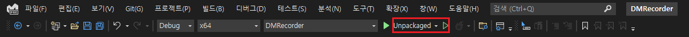
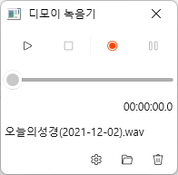
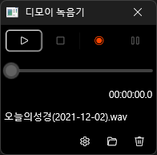

# DMRecorder : 디모이 녹음기

DMRecorder는 Windows App SDK 및 WinUI 3을 학습하기 위해 만든 간단한 녹음기 애플리케이션입니다. DMRecorder를 통해 다음의 Windows App SDK 및 WinUI 3의 기능을 확인할 수 있습니다.


## 컴파일 환경

- Windows 10 (19041) 이상 실행 가능
- .NET 6
- Visual Studio 2022
- Windows App SDK 1.0
   - Single-project MSIX Packaging Tool for VS 2022


## 단일 패키지

원래 WinUI 3 프로젝트는 단일 패키지를 지원하지 않았습니다. 기본 프로젝트 구성은 애플리케이션 프로젝트와 패키지 프로젝트로 놔눠져 있었습니다. 이제 Windows App SDK의 단일 패키지 기능으로 응용 애플리케이션이면서 배포할 수 있는 단일 프로젝트로 구성할 수 있습니다.


단일 패키지는 이제 프로젝트 템플릿을 통해 쉽게 구성할 수 있습니다. `확장 관리`를 통해 `Single-project MSIX Packaging Tool for VS 2022`를 설치해야 합니다.

단일 패키지 지원은 아직 `Preview` 상태이므로 csproj 파일에 다음의 설정이 포함되어 있어야 합니다.

```xaml
<EnablePreviewMsixTooling>true</EnablePreviewMsixTooling>
```


## 패키지, 비패키지 실행

Windows App SDK는 이제 `패키지` 실행과 `비패키지` 실행 모두 지원합니다. 패키지는 기존 MSIX으로 패키징 해서 설치하는 방식인데 Microsoft Store에 배포할 때 사용할 수 있습니다. 또한 비패키징 방식도 지원하는데 기존 설치툴을 그대로 이용하거나 개발시 `배포 시간`이 단축되므로 좀 더 빠르게 개발을 진행할 수 있습니다.

`패키지`와 `비패키지`은 프로파일을 선택해서 실행할 수 있는데 프로파일 설정은 다음과 같습니다.

| Properties/launchSettings.json
```json
{
  "profiles": {
    "Package": {
      "commandName": "MsixPackage"
    },
    "Unpackaged": {
      "commandName": "Project"
    }
  }
}
```

화면 상단의 다음의 영역으로 프로파일을 선택하고 실행할 수 있습니다.



`패키지`, `비패키지`를 선택할 때 csproj 파일의 설정도 변경을 해줘야 합니다.

- 패키지일 경우,
```xaml
...
<WindowsAppSdkBootstrapInitialize>false</WindowsAppSdkBootstrapInitialize>
...
```

- 비패키지일 경우,
```xaml
...
<WindowsAppSdkBootstrapInitialize>true</WindowsAppSdkBootstrapInitialize>
...
```

비패키지일 경우 부트스트렙에서 Windows App SDK의 사용할 버젼을 선택하고 초기화 하는 코드가 필요한데 `WindowsAppSdkBootstrapInitialize` 설정에 의해 코드가 자동으로 생성이 됩니다. 하지만 패키지에는 필요하지 않으므로 이 값을 `false`로 해야 실행이 됩니다.


## 다국어 지원

Windows App SDK에서는 패키지 리소스를 이용해 다국어를 지원합니다. 리소스는 기존과 동일한 `.resw` 확장자를 가지지만 `PRIResource`에 의해 pri 파일로 변환됩니다. `ResourceManager`나 `ResourceLoader`를 통해 리소스에 접근할 수 있으며 XAML에 `x:Uid`를 이용하면 `이름.속성` 형태로 리소스에 접근할 수 있습니다.

| 리소스 "Input.Text" 이름의 값이 TextBlock의 `Text`속성에 적용 됨
```xaml
...
    <TextBlock x:Uid="Input" FontSize="12" />
...
```

소스코드에서는 다음 처럼 확장을 만든 후

```csharp
public static class ResourceExtension
{
    private static ResourceLoader _resLoader = new();

    public static string GetLocalized(this string resourceKey)
    {
        return _resLoader.GetString(resourceKey);
    }
}
```

`"Name".GetLocalized()` 형태로 코드에서 사용할 수 있습니다.


## 윈도 테마 대응

윈도우는 `밝게`, `어둡게` 테마 컬러를 지원합니다. WinUI 3는 기본적으로 테마 컬러를 대응합니다.

| 테마 컬러가 `밝게`일 경우



| 테마 컬러가 `어둡게`일 경우




### 윈도 테마 컬러 변경 감지

WinUI 3는 윈도 테마 컬러가 변경되었을 떄 이를 알 수 있도록 이벤트를 제공합니다.

| `FrameworkElement`의 `ActualThemeChanged` 이벤트를 통해 테마 변경 감지
```csharp
    content.ActualThemeChanged += (s, e) => this.Theme = content.ActualTheme;
```


## 윈도 타이틀바 제어

WinUI 3은 타이틀바의 접근을 직접 할 수 없습니다. 전신이 UWP였기 때문인데 윈도 타이틀바에 접근하려면 `AppWindow`를 이용해야 합니다. `AppWindow`를 이용해 타이틀바 아이콘 및 제목, 각족 스타일을 설정할 수 있습니다.

`AppWindow` 인스턴스를 얻는 방법은 다음과 같습니다.

```csharp
    private AppWindow GetAppWindowForCurrentWidow()
    {
        var hWnd = WinRT.Interop.WindowNative.GetWindowHandle(this);
        var winId = Win32Interop.GetWindowIdFromWindow(hWnd);
        return AppWindow.GetFromWindowId(winId);
    }
```

DMRecorder는 `Window`를 재정의한 `CustomWindow`로 쉽게 `AppWindow`에 접근하는 코드를 보여줍니다.


## WinUI 3 XAML 컨트롤

WinUI 3에서 제공하는 XAML 컨트롤은 UWP WinUI 2.7의 XAML 컨트롤과 거의 동일합니다. UWP 개발자는 거의 동일한 감각으로 바로 WinUI 3를 개발할 수 있고 `Grid`나 `StackPanel`등의 패널 및 기본 컨트롤들이 WPF의 그것과 매우 유사하기 때문에 WPF 개발자도 금방 화면 개발이 가능합니다.

```xaml
        <Grid x:Name="recordPanel" RowSpacing="4" Padding="4">
            <Grid.RowDefinitions>
                <RowDefinition Height="*" />
                <RowDefinition Height="Auto" />
            </Grid.RowDefinitions>

            <local:RecordPanel Grid.Row="0" />

            <StackPanel Grid.Row="1" Orientation="Horizontal" HorizontalAlignment="Right">
                <Button x:Name="settingButton"  Background="Transparent" BorderThickness="0" Click="settingButton_Click">
                    <FontIcon FontFamily="Segoe Fluent Icons" Glyph="&#xe713;" FontSize="12" />
                </Button>
                <Button x:Name="openFolderButton" Background="Transparent" BorderThickness="0" Click="openFolderButton_Click">
                    <FontIcon FontFamily="Segoe Fluent Icons" Glyph="&#xe838;" FontSize="12" />
                </Button>
                <Button x:Name="deleteFileButton" Background="Transparent" BorderThickness="0" Click="deleteFileButton_Click">
                    <FontIcon FontFamily="Segoe Fluent Icons" Glyph="&#xe74d;" FontSize="12" />
                </Button>
            </StackPanel>
        </Grid>
```
